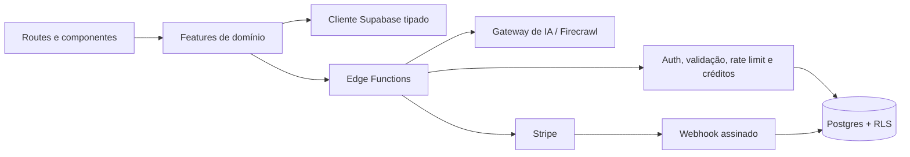

# Arquitetura V2

## Princípios

1. UI não altera plano, saldo ou ciclo de cobrança.
2. Páginas compõem features; regras e integrações ficam fora das páginas.
3. Cada ação de IA possui contrato validado, chave idempotente e job auditável.
4. Documentos editáveis e sequências são persistidos de forma explícita.
5. O MVP é single-owner. Times, referrals avançados e envio por ESP não fazem parte da V2.

## Frontend

`AppProviders` concentra React Query, Router, autenticação, tooltip e notificações. `AppRouter` faz lazy loading e usa `RequireAuth`/`RequirePlan`; as páginas não repetem o controle de acesso.

As features expõem modelos, APIs, hooks e UI específica. O editor usa um dispatcher pequeno e um componente por tipo de bloco. Geração, templates, histórico e documentos abrem o mesmo editor visual; o editor legado duplicado foi removido.

## Backend

As Edge Functions autenticadas validam JWT e corpo, aplicam CORS por allowlist, rate limit e logs estruturados. Funções de geração reservam créditos antes da chamada externa e concluem ou estornam o job de maneira transacional.

O Stripe Checkout aceita apenas itens do catálogo server-side. O webhook verifica assinatura, deduplica eventos e sincroniza assinatura/créditos. `save_email_sequence` grava a sequência e seus emails na mesma transação.

## Dados principais

- `generation_jobs`: estado e idempotência das gerações;
- `credit_ledger`: trilha imutável de débitos, estornos e concessões;
- `billing_customers` e `stripe_events`: estado e auditoria de billing;
- `email_documents`: blocos, HTML renderizado e versão do schema;
- `email_sequences` e `sequence_emails`: funis persistidos;
- tabelas existentes de campanhas, templates e manual de marca.

## Limites intencionais

- não existe envio de email nem integração ESP;
- não existe colaboração multiusuário;
- o HTML exportado contém o placeholder `{{unsubscribe_url}}`, que deve ser resolvido pelo ESP;
- alterações de catálogo, quota ou plano exigem mudança server-side e migration.
