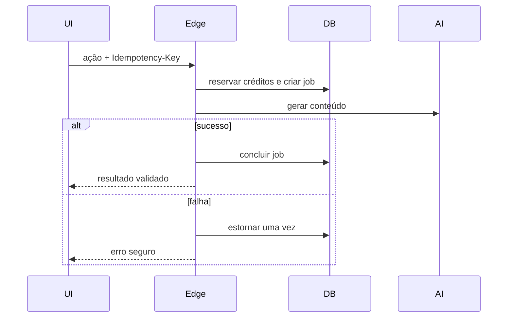

# Segurança V2

## Controles implementados

- RLS owner-scoped e ownership imutável nas tabelas do usuário;
- revogação de escrita direta em plano, saldo, ledger, jobs e billing;
- consumo e estorno de créditos por RPCs `SECURITY DEFINER` restritas;
- idempotência por intenção no cliente e por job no servidor;
- autenticação obrigatória em todas as funções, exceto webhook Stripe assinado;
- CORS por origem permitida, limites de corpo e respostas sem detalhes internos;
- rate limit persistido para IA, scraping, billing e portal;
- allowlist de produtos/preços Stripe e deduplicação de eventos;
- bloqueio de IPs privados, redirecionamentos e protocolos indevidos na análise de URL;
- sanitização do conteúdo, validação de URLs/CSS e preview em iframe sandboxed;
- dependências sem vulnerabilidades conhecidas no `npm audit` desta entrega.

## Fluxo de créditos

## Nota de migração

A V1 permitia que usuários autenticados alterassem diretamente `plan` e `user_credits`. Por isso os saldos legados não são uma fonte confiável. A migration `20260713000000_v2_backend_foundation.sql` normaliza contas ao teto Free (5 emails, 1 análise e extras zero). Uma assinatura Stripe ativa e corretamente vinculada restaura a quota do plano uma única vez por ciclo.

Faça backup e valide esse comportamento em staging antes do rollout. Se houver créditos legítimos vendidos fora do Stripe, reconcilie-os por uma operação administrativa auditada depois da migration; não preserve cegamente os valores contamináveis da V1.

## Segredos e operação

- `.env` é ignorado; apenas `.env.example` é versionado.
- `SUPABASE_SERVICE_ROLE_KEY`, chaves Stripe, IA e Firecrawl existem somente nas Edge Functions.
- restrinja `APP_ORIGIN`/`ALLOWED_ORIGINS` aos hosts reais.
- gire qualquer segredo que já tenha sido publicado no histórico Git.
- monitore `stripe_events`, `generation_jobs`, `credit_ledger` e logs estruturados.

## Limite conhecido de reembolso

Reembolsos parciais repetidos do mesmo pacote convertem cada evento monetário em créditos com arredondamento proporcional. O agregado pode diferir em um crédito. Antes de oferecer esse fluxo como funcionalidade regular, evolua o ledger para acumular o valor monetário reembolsado por compra e calcular o total de créditos cancelados de forma cumulativa. Reembolsos integrais e chargebacks continuam cobertos pelo fluxo atual.

## Checklist de publicação

1. backup do banco e rollout em staging;
2. migrations e testes de RLS com usuários distintos;
3. segredos e allowlist de origem configurados;
4. webhook Stripe cadastrado e assinatura validada;
5. checkout, portal, upgrade, downgrade, crédito extra e retry testados;
6. `npm run check` e `npm audit` verdes;
7. revisão manual do HTML exportado nos principais clientes de email.
